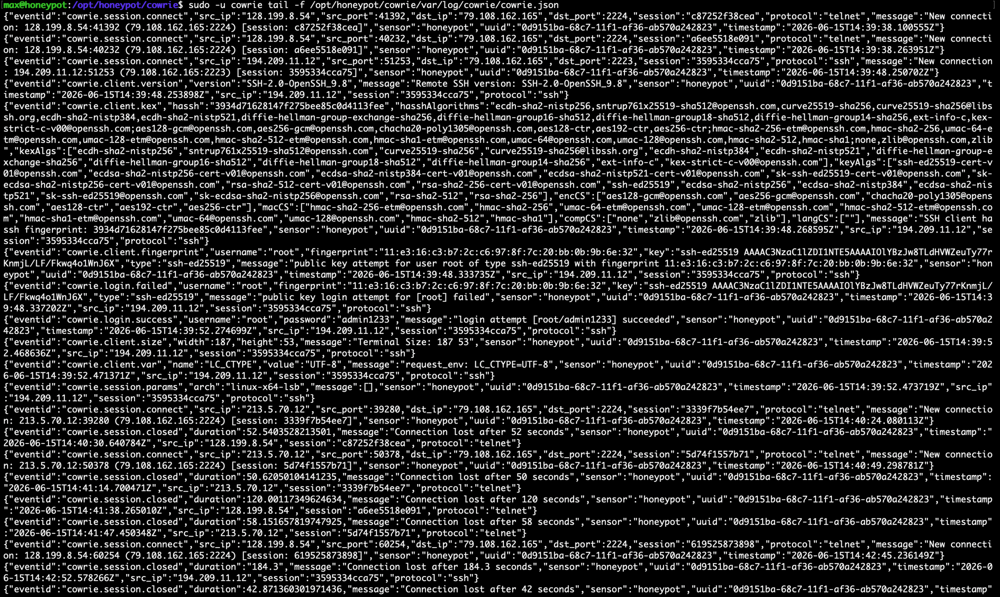
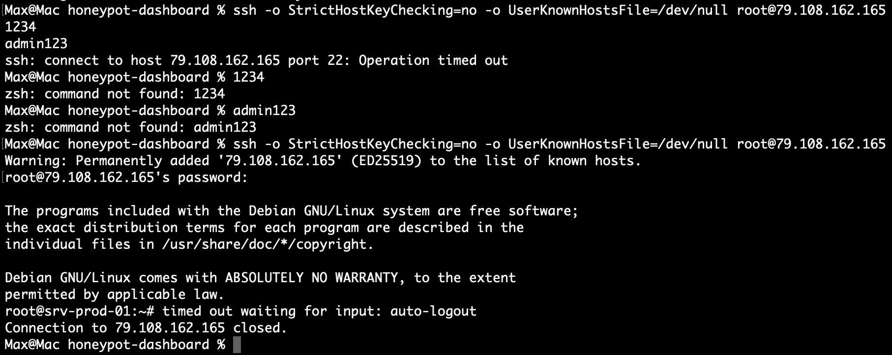

# Honeypot + Live Attack Map
 
 
**Stack:** Python · Flask · Cowrie · SQLite · Leaflet.js · Chart.js  
**Server:** Kamatera · Ubuntu 22.04 · 1 vCPU / 2 GB / 30 GB · Frankfurt  
**Kosten:** Kamatera 30-day free trial (hourly billing; delete server before trial ends)

## Architektur
 
```
Internet (echte Angreifer)
        │
        ▼
  [Cowrie Honeypot]  ←── SSH Port 22 / Telnet Port 23
  JSON logs bei jedem Angriff
        │
        ▼
  [log_parser.py]    ←── Lauft jede 5 min via cron
  GeoIP enrichment → SQLite DB
        │
        ▼
  [Flask API]        ←── /api/attacks  /api/stats  /api/recent
        │
        ▼
  [Dashboard]        ←── Leaflet world map + Chart.js stats
```
 
---
 
## Projekt Status
 
| Week | Topic | Status |
|------|-------|--------|
| 1 | VPS · Cowrie · Firewall | Fertig —> Honeypot live |
| 2 | Log Parser · SQLite · GeoIP | Code fertig, Deployment offen |
| 3 | Flask API · Auth · Security Headers | Nicht angefangen |
| 4 | Dashboard · World Map · Charts | Nicht angefangen |
| 5 | Analysis · HIBP · Botnet Detection | Nicht angefangen |
| 6 | HTTPS · Hardening · Documentation | Nicht angefangen |
  
---
 
## Lokal starten (Quickstart)

> Voraussetzungen: Python 3.11+ und git. Der Honeypot-Sensor selbst läuft auf dem
> Server — lokal nimmst du die Pipeline (Parser + Tests, ab Woche 3/4 auch API +
> Dashboard) in Betrieb.

```bash
git clone https://github.com/MaximilianNoethe/M183.git
cd M183/honeypot-dashboard

python3 -m venv .venv
source .venv/bin/activate
pip install -r requirements.txt

cp .env.example .env          # Werte anpassen: DASHBOARD_USER/PASSWORD, SECRET_KEY
```

**Tests laufen lassen** — beweist, dass Parser + GeoIP lokal funktionieren:

```bash
pytest tests/ -v              # 11 Tests gegen tests/fixtures/sample_cowrie.json
```

**Parser lokal ausprobieren** — schreibt die 20 Beispiel-Events des Fixtures in eine
lokale SQLite-DB (optional, macht echte GeoIP-Abfragen → ~30s beim ersten Mal):

```bash
COWRIE_LOG_PATH=tests/fixtures/sample_cowrie.json DATABASE_PATH=local.db \
  python3 -m parser.log_parser
sqlite3 local.db "SELECT COUNT(*) FROM attacks;"
```

**API + Dashboard** (ab Woche 3/4):

```bash
python3 -m api.app            # startet Flask auf http://localhost:8080
```

Auf dem Server läuft der Parser nicht manuell, sondern automatisch via systemd-Timer
gegen die echten Cowrie-Logs (alle 5 Min).

---

## Journal
 
> Dieses Journal tracked was ich geplant habe vs. was ich wirklich erreicht habe in dieser Woche

> Das Journal wird nach jedem Arbeitsblock geupdated
 
---
 
### Week 1 — Infrastructure & Honeypot Sensor
 
**Period:** `08.06.2026 – 15.06.2026`  
**Status:** Honeypot live —> fängt echte Angriffe aus dem Internet
 
#### Geplant
- Kamatera VPS bestellen, Ubuntu 22.04
- Echten SSH auf Port 2222 verschieben
- UFW Firewall konfigurieren (Ports 22, 23, 2222, 2223, 2224, 8080)
- Cowrie installieren und konfigurieren (JSON-Logs, Fake-Hostname)
- iptables NAT: Port 22/23 -> Cowrie 2223/2224
- Ersten Log-Eintrag in cowrie.json bestätigen
#### Erledigt
- Kamatera VPS bestellt & läuft: Frankfurt, Ubuntu 22.04, Type B, 1 vCPU / 2 GB RAM / 30 GB SSD, öffentliche WAN-IP. 

- SSH-Key erstellt: auf dem Mac.
- Kompletter 1. Woche Code geschrieben: (lokal, noch nicht auf dem Server ausgeführt):
  - parser/db.py -> DB-Schema + Testss
  - scripts/setup_server.sh -> SSH Hardening, UFW, iptables NAT
  - scripts/setup_cowrie.sh —> Cowrie Install + JSON Logging
  - systemd/ —> Units für Cowrie, Parser Timer und API
- Projektgerüst: für alle 6 Wochen + .gitignore, requirements.txt, .env.example.

**Deployment am 15.06.2026 —> Honeypot ist live gegangen:**
- Admin User max mit SSH-Key + sudo angelegt, Root- und Passwort-Login deaktiviert, echter SSH auf Port 2222.
- setup_server.sh ausgeführt: UFW aktiv, iptables NAT (öffentlich 22/23 → Cowrie 2223/2224).
- setup_cowrie.sh ausgeführt: Cowrie als User cowrie im eigenen venv, JSON Logging, Fake Hostname srv-prod-01.
- systemd Service honeypot cowrie läuft und startet automatisch beim Boot.
- Erster Angriff bestätigt —> eigener SSH-Test und bereits echte Bots aus dem Internet.

Live-Log (cowrie.json) mit echten Verbindungen:



Eigener SSH-Test —> gelandet in der Cowrie-Fake-Shell root@srv-prod-01:



**Woran man sieht, dass nicht nur ich angegriffen habe:**
- Meine eigene IP ist 194.209.11.12, das ist mein SSH-Test (Protokoll ssh auf Port 2223 endet mit cowrie.login.success für root/admin1233).
- Die IPs 128.199.8.54 und 213.5.70.12 habe ich nicht ausgelöst, das sind fremde Bots die von selbst auf den Telnett Port 2224 verbunden haben ("protocol":"telnet", mehrere cowrie.session.connect). 128.199.8.54 gehört zu DigitalOcean — typische Scanner-Infrastruktur.
- Faustregel fürs Log: jede src_ip, die nicht 194.209.11.12 ist, ist ein fremder Angreifer. Schon in den ersten paar Minuten mehrere fremde Sessions.

#### Probleme & Notizen
- Hetzner → Kamatera gewechselt um den 30-Tage-Gratis-Trial zu nutzen.
- Reminder: Server vor Trial-Ende (30 Tage) löschen, sonst wird abgezahlt.
---
 
### Week 2 — Log Parser & Database Pipeline
 
**Period:** `15.06.2026`  
**Status:** Code fertig & getestet, das Deployment ist auf dem Server offen
 
#### Geplant
- SQLite Schema erstellen (attacks + ip_cache Tabellen, Indizes)
- parser/log_parser.py schreiben — Cowrie JSON → DB
- parser/geoip.py, ip-api.com Integration mit Cache
- Deduplizierung: Parser merkt sich letzten verarbeiteten Log-Offset
- Cron-Job einrichten: alle 5 Minuten
- DB mit echten Daten bestätigen (`SELECT COUNT(*) FROM attacks`)
#### Erledigt
- DB Helfer in parser/db.py ergänzt: insert_attack, get_offset / set_offset cache_get/cache_set.
- parser/geoip.py -> GeoIP über ip-api.com immer erst ip_cache prüfen, auf 45 req pro min herunter geschalten.
- parser/log_parser.py — liest cowrie.json ab gespeichertem Offset, filtert relevante Events, reichert mit GeoIP an, schreibt parametrisiert in SQLite.
- Tests: 11 grün (5 DB + 6 neue für Parser & GeoIP), laufen gegen das Fixture mit RFC-5737-IPs.
- Offen für nächste Session: Parser auf dem Server ausrollen (venv + .env + systemd-Timer alle 5 Min) und DB mit echten Daten bestätigen.
#### Probleme & Notizen
- Cron durch systemd Timer ersetzt (honeypot-parser.timer, alle 5 Min) so ist est sauberer als Crontab.
- Parser code ist fertig & getestet. Das Live Schalten auf dem Server kommt in der nächsten Session.
---
 
### Week 3 — Flask REST API
 
**Period:** `DD.MM.YYYY – DD.MM.YYYY`  
**Status:**  Nicht angefangen
 
#### Planned
- [ ] Flask App Factory in `api/app.py`
- [ ] `GET /api/attacks` — Kartendaten (IP-Cluster mit lat/lon/count)
- [ ] `GET /api/stats` — Aggregierte Statistiken
- [ ] `GET /api/recent` — Live-Feed letzte 50 Events
- [ ] HTTP Basic Auth Decorator (`api/auth.py`)
- [ ] Security Headers Middleware (CSP, X-Frame-Options, etc.)
- [ ] Rate Limiting via `flask-limiter` (60 req/min)
- [ ] Alle SQL-Queries: nur Parameterized Statements
#### Actually done
> *(Fill in after the session)*
 
-
#### Problems & notes
> *(Anything unexpected, links, commands that helped)*
 
-
---
 
### Week 4 — Dashboard Frontend
 
**Period:** `DD.MM.YYYY – DD.MM.YYYY`  
**Status:**  Nicht angefangen
 
#### Planned
- [ ] Leaflet.js Weltkarte mit CartoDB Dark Theme
- [ ] Circle Markers skaliert nach `log(count)`, Popups mit Details
- [ ] Stat-Karten: Total Angriffe, Unique IPs, Länder
- [ ] Chart.js: Top 10 Passwörter (Bar), Angriffe pro Stunde (Line)
- [ ] Live-Feed Tabelle: letzte 50 Angriffe scrollend
- [ ] Auto-Refresh alle 30 Sekunden (kein Full-Page-Reload)
- [ ] Design: Terminal-Ästhetik (#0a0a0a bg, #00ff41 text, Monospace)
- [ ] Alles via `textContent` rendern — kein `innerHTML`
#### Actually done
> *(Fill in after the session)*
 
-
#### Problems & notes
> *(Anything unexpected, links, commands that helped)*
 
-
---
 
### Week 5 — Analysis & Advanced Features
 
**Period:** `DD.MM.YYYY – DD.MM.YYYY`  
**Status:**  Nicht angefangen
 
#### Planned
- [ ] `analysis/hibp_check.py` — k-Anonymity SHA1-Prefix Check
- [ ] `analysis/botnet_detector.py` — koordinierte Angriffe erkennen
- [ ] `GET /api/analysis/passwords` — Top Passwörter + HIBP Treffer
- [ ] `GET /api/analysis/botnet` — verdächtige Angriffswellen
- [ ] `GET /api/export/csv` — Auth-geschützter Daten-Export
- [ ] Analysis-Tab im Dashboard
#### Actually done
> *(Fill in after the session)*
 
-
#### Problems & notes
> *(Anything unexpected, links, commands that helped)*
 
-
---
 
### Week 6 — HTTPS, Hardening & Documentation
 
**Period:** `DD.MM.YYYY – DD.MM.YYYY`  
**Status:**  Nicht angefangen
 
#### Planned
- [ ] nginx Reverse Proxy vor Flask
- [ ] Let's Encrypt Zertifikat via Certbot
- [ ] HSTS Header in nginx
- [ ] Fail2Ban: SSH Port 2222 + Dashboard Rate-Limit
- [ ] Alle Secrets in `.env` — keine Hardcoded Values
- [ ] `git log` prüfen — keine Secrets in History
- [ ] `RESEARCH.md` schreiben (Findings, Statistiken, Erkenntnisse)
- [ ] README finalisieren mit Screenshots
#### Actually done
> *(Fill in after the session)*
 
-
#### Problems & notes
> *(Anything unexpected, links, commands that helped)*
 
-
---
 
## Research Findings
 
> *(Filled in during Week 6 — real data from the honeypot)*
 
| Metric | Value |
|--------|-------|
| Time to first attack after deployment | — |
| Total attacks collected | — |
| Unique attacker IPs | — |
| Countries represented | — |
| Most attacked username | — |
| Most tried password | — |
| Longest single botnet wave | — |
| Password found in HIBP (top hit) | — |
 
