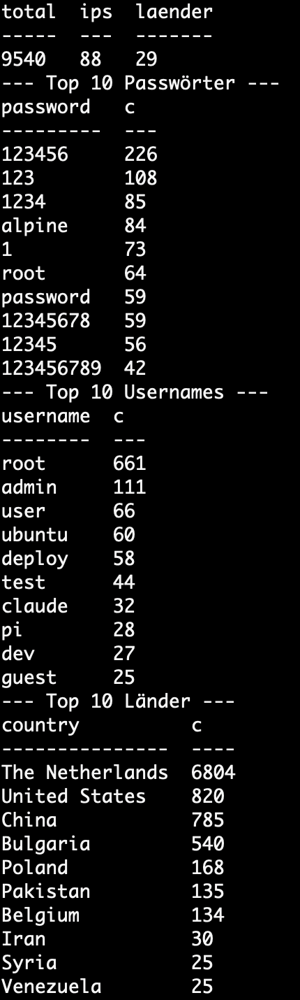
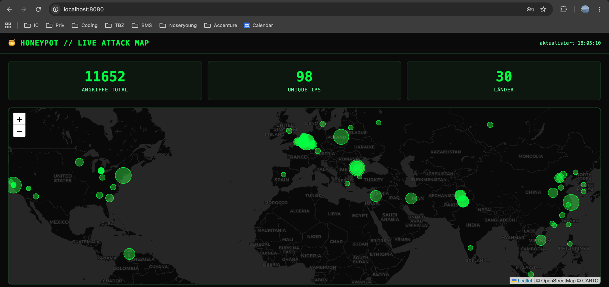
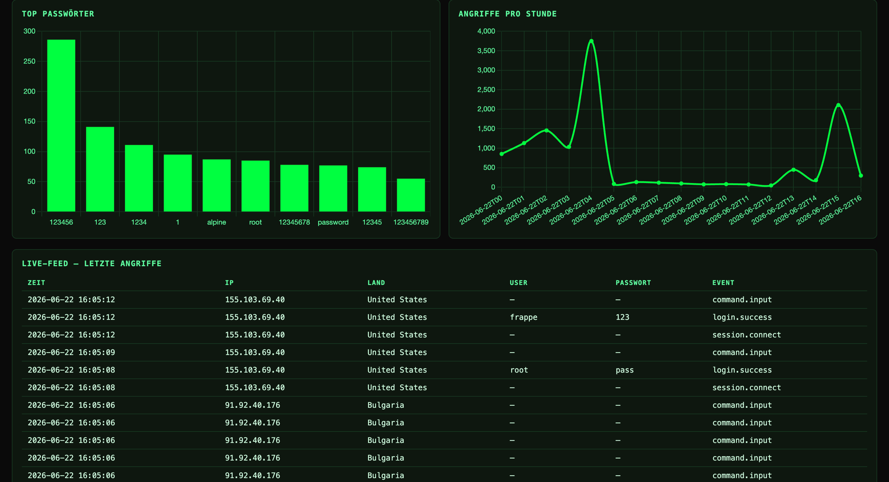

# Honeypot + Live Attack Map

[](https://github.com/MaximilianNoethe/M183/actions/workflows/tests.yml)

**Stack:** Python · Flask · Cowrie · SQLite · Leaflet.js · Chart.js  
**Server:** Kamatera · Ubuntu 22.04 · 1 vCPU / 2 GB / 30 GB · Frankfurt  
**Kosten:** Kamatera 30-day free trial (hourly billing; delete server before trial ends)

## Architektur
 
```
Internet (echte Angreifer)
        │   SSH :22 / Telnet :23  ──NAT──>  Cowrie :2223 / :2224
        ▼
  [Cowrie Honeypot]              JSON-Logs bei jedem Angriff
        │
        ▼
  [log_parser.py]                systemd-Timer alle 5 min, liest auch rotierte Logs
  GeoIP + ASN (ip-api, Cache)  ─────────────>  SQLite
        │
        ▼
  [Flask API]   /api/health /attacks /stats /recent /search
                /api/analysis/* (HIBP · Botnet · Befehle · Provider · Attacker · Timeline)
                /api/export/csv · /api/export/json
        │   Basic Auth + Bearer-Token + Security-Header + Rate-Limit
        ▼
  [nginx :443]  selbstsigniertes HTTPS  ──>  Flask :8080 (localhost)
        │
        ▼
  [Dashboard]   Leaflet-Karte · Chart.js · Live-Feed · Analyse · Suche
```

### Wie der Server aufgesetzt ist (und warum)
Damit **echte** Bots den Honeypot finden, braucht er eine **öffentliche IP direkt im
Internet**. Ein Rechner zuhause hängt hinter dem Router (NAT/Firewall) — da kommen die
Angreifer nicht ran — und man will Angreifer ohnehin nie auf dem eigenen Gerät haben.
Darum läuft alles auf einem **Kamatera-VPS** (Ubuntu 22.04, Frankfurt, 30-Tage-Trial,
danach löschen). Das ist ein isolierter Wegwerf-Server.

- **Admin-Zugang:** echter SSH liegt auf **Port 2222** (nur mit SSH-Key, Root- und
  Passwort-Login deaktiviert). Verwaltet wird der Server komplett über das **Terminal auf
  dem MacBook** per `ssh -p 2222 max@<IP>` — ein Server hat keinen Bildschirm/Maus.
- **Der Köder:** die öffentlichen Ports **22/23** werden per **iptables-NAT** auf Cowrie
  (**2223/2224**) umgeleitet. So landen alle Angreifer im Honeypot, ohne den echten
  Admin-SSH auf 2222 zu stören.
- **Dienste laufen über systemd** (kein Docker): `honeypot-cowrie` (Köder),
  `honeypot-parser.timer` (Parser alle 5 Min), `honeypot-api` (Flask).
- **Dashboard ist nicht öffentlich:** die Flask-API lauscht bewusst nur auf
  `127.0.0.1:8080`. Zum Ansehen baut man einen **SSH-Tunnel**
  (`ssh -p 2222 -L 8080:127.0.0.1:8080 …`) und öffnet `http://localhost:8080` im
  Mac-Browser — der zeigt dann verschlüsselt das Dashboard **vom Server**. nginx legt
  zusätzlich HTTPS davor.
- **Entwickelt wird lokal:** Code auf dem Mac schreiben → nach GitHub pushen → auf dem
  Server `sudo git -C /opt/honeypot pull` + Dienst neu starten. Voller Ablauf:
  [`docs/DEPLOYMENT.md`](docs/DEPLOYMENT.md).

### Tests & CI-Pipeline (GitHub Actions)
Bei jedem `git push`, der etwas unter `honeypot-dashboard/**` ändert, läuft automatisch
die Pipeline `.github/workflows/tests.yml`: Python 3.11 einrichten → Abhängigkeiten
installieren → **ruff** (Lint) → **pytest** (38 Tests). Schlägt Lint oder ein Test fehl,
wird der Lauf rot. Wichtig zu verstehen: Actions läuft **einmal pro Push, auf dem
neuesten Commit** (nicht einmal pro Commit) — und dieser Commit enthält den gesamten Code
aller Commits zusammen, ein Lauf testet also das ganze Projekt. Das grüne Badge ganz oben
zeigt den Status des letzten Laufs.
 
---
 
## Projekt Status
 
| Woche | Thema | Status |
|------|-------|--------|
| 1 | VPS · Cowrie · Firewall | Fertig — Honeypot live, fängt echte Angriffe |
| 2 | Log-Parser · SQLite · GeoIP | Deployed — Parser läuft live auf dem Server |
| 3 | Flask-API · Auth · Security-Header | Fertig — deployed |
| 4 | Dashboard · Weltkarte · Charts | Fertig — live mit echten Angriffen |
| 5 | Analyse · HIBP · Botnet-Erkennung | Fertig — RESEARCH.md mit echten Funden |
| 6 | HTTPS · Hardening · Dokumentation | Configs/Skripte + Doku fertig, Server-Deploy offen |
| 07 | Erweiterungen · Härtung · Doku | Fertig — 38 Tests grün, CI aktiv |

---

## Dokumentation
- **[`docs/API.md`](docs/API.md)** — alle API-Endpoints, Auth (Basic + Token), Beispiele
- **[`docs/DEPLOYMENT.md`](docs/DEPLOYMENT.md)** — Schritt-für-Schritt Server-Runbook
- **[`SECURITY.md`](SECURITY.md)** — Threat-Model, Härtung, Datenschutz (DSG)
- **[`RESEARCH.md`](RESEARCH.md)** — Auswertung & Interpretation der echten Angriffe

---
 
## Lokal starten (Quickstart)

> Voraussetzungen: Python 3.11+ und git. Der Honeypot-Sensor selbst läuft auf dem
> Server — lokal nimmst du die ganze Pipeline (Parser, API und Dashboard) in Betrieb.

```bash
git clone https://github.com/MaximilianNoethe/M183.git
cd M183/honeypot-dashboard

python3 -m venv .venv
source .venv/bin/activate
pip install -r requirements.txt

cp .env.example .env          # Werte anpassen: DASHBOARD_USER/PASSWORD, SECRET_KEY
```

**Tests laufen lassen** — beweist, dass Parser + GeoIP lokal funktionieren:

```bash
pytest tests/ -v              # 38 Tests (Parser, API, Analyse)
```

**Dashboard lokal mit Beispieldaten ansehen** (empfohlen) — füllt eine lokale DB mit
Demo-Angriffen (inkl. Standorten, Provider, einer Botnet-Welle und `wget`-Befehlen),
damit **jedes** Panel inkl. Weltkarte gefüllt ist:

```bash
DATABASE_PATH=local.db python3 scripts/seed_demo.py   # ~68 Beispiel-Angriffe
DATABASE_PATH=local.db python3 -m api.app             # Flask auf http://localhost:8080
```

Dann `http://localhost:8080` öffnen und mit `DASHBOARD_USER` / `DASHBOARD_PASSWORD`
aus deiner `.env` einloggen (Default: `admin` / `changeme`). Sichtbar: volle Weltkarte,
Statistik-Karten, Charts, Live-Feed, der Analyse-Bereich (Befehle, HIBP, Botnet,
Provider, aggressivste IPs) und die Suche.

> Die Demo-Daten sind klar gekennzeichnete Beispiel-Angriffe (RFC-5737-IPs) — nur zum
> Ausprobieren der Oberfläche. Die **echten** Funde stehen in [`RESEARCH.md`](RESEARCH.md).

**Alternativ: die echte Pipeline mit dem Parser** — schreibt die 20 Events des Fixtures
über echte GeoIP-Abfragen in die DB (~30s). Die Weltkarte bleibt hier leer, weil die
Test-IPs keine Geo-Position haben:

```bash
COWRIE_LOG_PATH=tests/fixtures/sample_cowrie.json DATABASE_PATH=fixture.db \
  python3 -m parser.log_parser
sqlite3 fixture.db "SELECT COUNT(*) FROM attacks;"
```

Auf dem Server läuft der Parser nicht manuell, sondern automatisch via systemd-Timer
gegen die echten Cowrie-Logs (alle 5 Min).

---

## Journal
 
> Dieses Journal hält pro Woche fest, was ich **geplant** habe, was ich **erledigt**
> habe und auf welche **Probleme** ich gestossen bin. Aktualisiert nach jedem Arbeitsblock.

> **Zu den Stundenangaben:** Sie umfassen die *gesamte* Arbeit — Server-Administration,
> Debugging, Warten auf langsame Schritte (GeoIP-Drossel, 70k-Zeilen-DB-Rebuild),
> Recherche und Schreiben — nicht nur das Coden. Darum liegen sie über der reinen
> Commit-Dichte; die „Probleme & Notizen" zeigen, wo die Zeit konkret hinging. Gearbeitet
> wurde in fokussierten Sessions; der **22.06. war ein „Mega-Session"-Tag** (Wochen 2–6
> am Stück, Commits bis 22:34 Uhr). Summe über alles: ~20 h geplant → **~20 h tatsächlich**.
 
---
 
### Woche 1 — Infrastruktur & Honeypot-Sensor
 
**Zeitraum:** `08.06.2026 – 15.06.2026`  
**Status:** Honeypot live —> fängt echte Angriffe aus dem Internet
 
#### Geplant
- Kamatera VPS bestellen, Ubuntu 22.04
- Echten SSH auf Port 2222 verschieben
- UFW Firewall konfigurieren (Ports 22, 23, 2222, 2223, 2224, 8080)
- Cowrie installieren und konfigurieren (JSON-Logs, Fake-Hostname)
- iptables NAT: Port 22/23 -> Cowrie 2223/2224
- Ersten Log-Eintrag in cowrie.json bestätigen
- **Aufwand (geschätzt): ~5 h**
#### Erledigt
- Kamatera VPS bestellt & läuft: Frankfurt, Ubuntu 22.04, Type B, 1 vCPU / 2 GB RAM / 30 GB SSD, öffentliche WAN-IP. 

- SSH-Key erstellt: auf dem Mac.
- Kompletter 1. Woche Code geschrieben: (lokal, noch nicht auf dem Server ausgeführt):
  - parser/db.py -> DB-Schema + Testss
  - scripts/setup_server.sh -> SSH Hardening, UFW, iptables NAT
  - scripts/setup_cowrie.sh —> Cowrie Install + JSON Logging
  - systemd/ —> Units für Cowrie, Parser Timer und API
- Projektgerüst: für alle 6 Wochen + .gitignore, requirements.txt, .env.example.

**Deployment am 15.06.2026 —> Honeypot ist live gegangen:**
- Admin User max mit SSH-Key + sudo angelegt, Root- und Passwort-Login deaktiviert, echter SSH auf Port 2222.
- setup_server.sh ausgeführt: UFW aktiv, iptables NAT (öffentlich 22/23 → Cowrie 2223/2224).
- setup_cowrie.sh ausgeführt: Cowrie als User cowrie im eigenen venv, JSON Logging, Fake Hostname srv-prod-01.
- systemd Service honeypot cowrie läuft und startet automatisch beim Boot.
- Erster Angriff bestätigt —> eigener SSH-Test und bereits echte Bots aus dem Internet.

Live-Log (cowrie.json) mit echten Verbindungen:


Eigener SSH-Test —> gelandet in der Cowrie-Fake-Shell root@srv-prod-01:


**Woran man sieht, dass nicht nur ich angegriffen habe:**
- Meine eigene IP ist 194.209.11.12, das ist mein SSH-Test (Protokoll ssh auf Port 2223 endet mit cowrie.login.success für root/admin1233).
- Die IPs 128.199.8.54 und 213.5.70.12 habe ich nicht ausgelöst, das sind fremde Bots die von selbst auf den Telnett Port 2224 verbunden haben ("protocol":"telnet", mehrere cowrie.session.connect). 128.199.8.54 gehört zu DigitalOcean — typische Scanner-Infrastruktur.
- Faustregel fürs Log: jede src_ip, die nicht 194.209.11.12 ist, ist ein fremder Angreifer. Schon in den ersten paar Minuten mehrere fremde Sessions.

#### Probleme & Notizen
Diese Woche war die mit Abstand grösste Server-/Ops-Hürde — viel Zeit ging ins Debuggen,
nicht ins Coden:
- **Hoster gewechselt:** zuerst Hetzner geplant, dann auf **Kamatera** gewechselt, um den
  30-Tage-Gratis-Trial zu nutzen.
- **SSH-Key mit unbekannter Passphrase:** der erste Key liess sich nicht mehr nutzen →
  neuen Key **ohne** Passphrase erzeugt und neu hinterlegt.
- **git divergente Branches** beim ersten Server-Pull → musste auf `origin/main` rebasen.
- **Neueste Cowrie hat kein `bin/cowrie` mehr:** Installation läuft jetzt über
  `pip install -e .`, der systemd-`ExecStart` musste auf `cowrie-env/bin/cowrie` zeigen.
  (echte Debug-Zeit, bis der Dienst sauber startete)
- **UFW blockierte die per NAT umgeleiteten Ports 2223/2224** → Angriffe flossen erst,
  nachdem ich sie mit `ufw allow` freigegeben hatte. (lange gesucht, warum nichts ankam)
- **`chown -R` folgt dem `/opt/honeypot`-Symlink nicht** → den echten Zielordner manuell
  `mkdir`+`chown` müssen, sonst Rechte-Fehler.
- Reminder: Server vor Trial-Ende (~30 Tage) löschen, sonst wird abgerechnet.

**Aufwand: geschätzt ~5 h · tatsächlich ~6 h** (VPS-Setup, Hardening, Cowrie-Debugging,
NAT/UFW-Fehlersuche, Key-Neuerzeugung — verteilt auf 08.06. + Deploy am 15.06.).
---
 
### Woche 2 — Log-Parser & Datenbank-Pipeline
 
**Zeitraum:** `15.06.2026`  
**Status:** Code fertig & getestet; am 22.06.2026 auf dem Server deployed —> echte Angriffe landen in SQLite
 
#### Geplant
- SQLite Schema erstellen (attacks + ip_cache Tabellen, Indizes)
- parser/log_parser.py schreiben — Cowrie JSON → DB
- parser/geoip.py, ip-api.com Integration mit Cache
- Deduplizierung: Parser merkt sich letzten verarbeiteten Log-Offset
- Cron-Job einrichten: alle 5 Minuten
- DB mit echten Daten bestätigen (`SELECT COUNT(*) FROM attacks`)
- **Aufwand (geschätzt): ~3 h**
#### Erledigt
- DB Helfer in parser/db.py ergänzt: insert_attack, get_offset / set_offset cache_get/cache_set.
- parser/geoip.py -> GeoIP über ip-api.com immer erst ip_cache prüfen, auf 45 req pro min herunter geschalten.
- parser/log_parser.py — liest cowrie.json ab gespeichertem Offset, filtert relevante Events, reichert mit GeoIP an, schreibt parametrisiert in SQLite.
- Tests: 11 grün (5 DB + 6 neue für Parser & GeoIP), laufen gegen das Fixture mit RFC-5737-IPs.
- 🆕 **Zusätzlich (über die Planung hinaus, in späteren Blöcken ergänzt):**
  ASN/Provider-Anreicherung (`as`/`org` von ip-api), **rotierte Logs** mitlesen (ganze
  Woche statt nur 1 Tag), **Malware-Download-URLs** erfassen (`file_download`-Events) und
  **GeoIP-Batch-Lookup** (bis 100 IPs pro Request statt 88× einzeln mit Drossel).

**Deployment am 22.06.2026 (heute) —> Parser läuft auf dem Server:**
- Repo auf dem Server aktualisiert, Data-Dir `/var/lib/honeypot` angelegt (cowrie:cowrie).
- Eigenes Projekt-venv `/opt/honeypot/.venv` + requirements installiert (getrennt von Cowries venv).
- `.env` gesetzt (DATABASE_PATH, COWRIE_LOG_PATH, Dashboard-Login), Rechte 640 root:cowrie.
- Erster echter Parser-Lauf: 88 unterschiedliche Angreifer-IPs im Log, GeoIP-Anreicherung läuft, Angriffe landen in SQLite.
- systemd-Timer aktiviert (`honeypot-parser.timer`, alle 5 Min) → läuft seither vollautomatisch. Erster Backfill: **9540 Angriffe**, dann pro Auto-Lauf neue dazu (Offset-Dedup bestätigt: +319 im ersten 5-Min-Lauf).
- Erste Auswertung direkt per SQL auf dem Server — so sah es VOR dem Dashboard aus:


#### Probleme & Notizen
- Cron durch systemd Timer ersetzt (honeypot-parser.timer, alle 5 Min) so ist est sauberer als Crontab.
- Parser-Code war fertig & getestet; das Live-Schalten haben wir am 22.06. gemacht.

**Blockaden der Deployment-Session (22.06.2026):**
- README-Quickstart geschrieben (Reaktion auf Reviewer-Feedback, Note 4.5).
- git "dubious ownership" auf `/opt/M183` (Repo gehört root) → `safe.directory` + pull mit sudo (~10 min weg).
- nano: nicht mehr rausgekommen (`Ctrl+O` vs `Ctrl+0`), Terminal geschlossen, `.env` nochmal gemacht (~15 min weg).
- `sqlite3` war auf dem Server nicht installiert → `apt-get install` (mit Kernel-Upgrade-/needrestart-Dialogen).
- `.env` `DASHBOARD_USER` hatte versteckte Leerzeichen am Ende → gerade noch gefangen, bevor es Basic Auth brach.
- Parser-Lauf wirkte „hängend" → war die GeoIP-Drossel (1,4 s pro neuer IP, ~2 Min bei 88 IPs). Einmal aus Versehen mit Ctrl+C abgebrochen (committet erst am Ende → nichts gespeichert), dann durchlaufen lassen.
- Wo Zeit verloren geht: Server-Bedienung (nano/Rechte/sudo/Ownership) + Warten auf GeoIP. Die Idee „ip-api Batch-Endpoint" wurde in Block 07 tatsächlich umgesetzt.

**Aufwand: geschätzt ~3 h · tatsächlich ~3 h** (Parser+Tests am 15.06., Deployment am
22.06. mit den obigen Blockaden).
---
 
### Woche 3 — Flask-REST-API
 
**Zeitraum:** `22.06.2026`  
**Status:** Fertig —> API läuft, 18 Tests grün, auf dem Server deployed
 
#### Geplant
- [x] Flask App Factory in `api/app.py`
- [x] `GET /api/attacks` — Kartendaten (IP-Cluster mit lat/lon/count)
- [x] `GET /api/stats` — Aggregierte Statistiken
- [x] `GET /api/recent` — Live-Feed letzte 50 Events
- [x] HTTP Basic Auth Decorator (`api/auth.py`)
- [x] Security Headers Middleware (CSP, X-Frame-Options, etc.)
- [x] Rate Limiting via `flask-limiter` (60 req/min)
- [x] Alle SQL-Queries: nur Parameterized Statements
- **Aufwand (geschätzt): ~2 h**
#### Erledigt
- App-Factory `api/app.py` baut Flask, registriert Blueprints + Middleware, liefert das Dashboard unter `/`.
- Endpoints: `/api/attacks` (Kartendaten), `/api/stats` (Totals + Top-10 Usernames/Passwörter/Länder + Angriffe pro Stunde), `/api/recent` (letzte 50), `/api/search` (parametrisierte Filter).
- Basic Auth (`hmac.compare_digest`) auf allen `/api/*` und auf der Dashboard-Seite. Security-Header (CSP, X-Frame-Options, nosniff) auf jeder Antwort, Rate-Limit 60/min.
- Liest die DB über `parser.db.get_connection` (kein doppelter Code), alle Queries parametrisiert.
- 7 neue API-Tests, insgesamt **18 grün**; lokal per `curl` verifiziert (401 ohne Login, JSON mit Login).
- In 3 kleinen Commits gebaut, dann auf dem Server deployed (`honeypot-api.service`).
- 🆕 **Zusätzlich:** `/api/search` (parametrisierte Filter) war nicht ursprünglich
  geplant. In Block 07 kamen `/api/health` (ohne Auth), **Bearer-Token-Auth** und
  **JSON-Fehler-Handler** (404/429/500) dazu.
#### Probleme & Notizen
- Beim Server-Deploy lief der Service in einen **Crash-Loop** (`NotImplementedError`): der `git pull` auf dem Server war nicht durchgelaufen → der Dienst startete noch die Stub-Version. Lange gerätselt, bis klar war, dass der Server schlicht alten Code hatte. Fix: Service stoppen, `sudo git -C /opt/honeypot pull`, neu starten.
- API lauscht bewusst nur auf `127.0.0.1:8080` (nginx + HTTPS folgen in Woche 6) → Zugriff vorerst nur per SSH-Tunnel, was das Testen umständlicher machte.

**Aufwand: geschätzt ~2 h · tatsächlich ~2 h** (Bau + 18 Tests, dazu die Crash-Loop-Fehlersuche beim Deploy am 22.06.).
---
 
### Woche 4 — Dashboard-Frontend
 
**Zeitraum:** `22.06.2026`  
**Status:** Fertig —> Live-Dashboard zeigt echte Angriffe (11'652 zum Zeitpunkt des Screenshots)
 
#### Geplant
- [x] Leaflet.js Weltkarte mit CartoDB Dark Theme
- [x] Circle Markers skaliert nach `log(count)`, Popups mit Details
- [x] Stat-Karten: Total Angriffe, Unique IPs, Länder
- [x] Chart.js: Top 10 Passwörter (Bar), Angriffe pro Stunde (Line)
- [x] Live-Feed Tabelle: letzte 50 Angriffe
- [x] Auto-Refresh alle 30 Sekunden (kein Full-Page-Reload)
- [x] Design: Terminal-Ästhetik (#0a0a0a bg, #00ff41 text, Monospace)
- [x] Alles via `textContent` rendern — kein `innerHTML`
- **Aufwand (geschätzt): ~2 h**
#### Erledigt
- Single-Page-Dashboard (`frontend/templates/dashboard.html`) mit Leaflet-Weltkarte (CARTO Dark), Chart.js und Live-Feed, Terminal-Optik.
- Karte: ein grüner Kreis pro Angreifer-IP, Grösse nach `log(count)`, Popup mit IP/Land/Anzahl.
- Stat-Karten (Total / Unique IPs / Länder), Top-10-Passwörter (Balken), Angriffe pro Stunde (Linie), Live-Feed der letzten 50.
- Auto-Refresh alle 30s, alles über `textContent` gerendert (kein `innerHTML`, XSS-sicher).
- Dashboard-Seite hinter Login → der Browser nutzt den Login automatisch für die API-Abrufe.
- 🆕 **Zusätzlich (in späteren Blöcken):** Suchleiste über dem Feed, Panel „aggressivste
  IPs", Chart „Angriffe pro Tag", KPI-Karten (aktivste Stunde, Zeitraum), manueller
  Refresh-Button.

Live mit echten Daten (11'652 Angriffe, 98 IPs, 30 Länder):




#### Probleme & Notizen
- **SSH-Tunnel nötig** (`ssh -p 2222 -L 8080:127.0.0.1:8080 …`), weil die API nur auf localhost lauscht. Das „Connection refused" im Tunnel war zuerst verwirrend — es hiess in Wahrheit: der Service lief noch gar nicht (siehe Crash-Loop in Woche 3).
- Erkenntnisse aus den echten Daten: Niederlande massiv überrepräsentiert (Hosting-Infrastruktur, nicht Standort der Angreifer); klarer Angriffs-Peak um ~04:00 und ~15:00 Uhr; `alpine`/`pi` deuten auf gezielte IoT-Angriffe.

**Aufwand: geschätzt ~2 h · tatsächlich ~2 h** (Bau von Karte/Charts/Feed + Tunnel-/Anzeige-Fehlersuche, 22.06.).
---
 
### Woche 5 — Analyse & erweiterte Features
 
**Zeitraum:** `22.06.2026`  
**Status:** Fertig —> Analyse-Features live, `RESEARCH.md` mit echten Funden
 
#### Geplant
- [x] `analysis/hibp_check.py` — k-Anonymity SHA1-Prefix Check
- [x] `analysis/botnet_detector.py` — koordinierte Angriffe erkennen
- [x] `GET /api/analysis/passwords` — Top Passwörter + HIBP Treffer
- [x] `GET /api/analysis/botnet` — verdächtige Angriffswellen
- [x] `GET /api/export/csv` — Auth-geschützter Daten-Export
- [x] Analyse-Bereich im Dashboard (statt Tab)
- **Aufwand (geschätzt): ~2 h**
#### Erledigt
- `hibp_check.py` — HaveIBeenPwned über k-Anonymity (nur 5 SHA1-Zeichen verlassen den Server).
- `botnet_detector.py` — findet Minuten mit ≥5 verschiedenen IPs (koordinierte Wellen).
- API: `/api/analysis/passwords` (Top-PW + Leak-Treffer), `/api/analysis/botnet`, `/api/analysis/commands` (Top-Befehle der Angreifer), `/api/export/csv`.
- Dashboard: neuer Analyse-Bereich (Top-Befehle, HIBP-Leak-Treffer, Botnet-Wellen) + CSV-Export-Button.
- 6 neue Tests (insgesamt **24 grün**), auf dem Server deployed.
- **`RESEARCH.md` geschrieben** mit echten Zahlen + Interpretation (über die ganze Woche: **70'020 Angriffe, 1'242 IPs, 75 Länder**).
- 🆕 **Zusätzlich (über die Planung hinaus):** `/api/analysis/commands` (Top-Befehle),
  `/api/analysis/downloads` (Malware-Nachladen), `/api/analysis/providers` (Top-ASN) und
  **JSON-Export** zusätzlich zu CSV. In Block 07 kamen `/api/analysis/attackers` und
  `/api/analysis/timeline` dazu.
#### Erkenntnisse (Highlights, Details in `RESEARCH.md`)
- **100 % der Top-Passwörter** stehen in HIBP — `123456` allein in **210 Mio** Leaks. Die Bots fahren reine Leak-Listen ab.
- **~60 % des Traffics aus nur 26 IPs** zweier Offshore-Hoster (Pfcloud UG, Offshore LC) — die ASN-Sicht ist schärfer als die Länder-Statistik.
- Häufigster Befehl: `uname -s -v -n -r -m` (17'828×, OS-Fingerprinting). Der Befehl `cat /etc/shadow /etc/passwd` (82×) zeigt gezielten **Passwort-Hash-Klau**.
- Recon-Skripte prüfen RAM/CPU/GPU (`nvidia`) → Eignung fürs **Krypto-Mining**; dazu `sudo -S` mit Leak-Passwörtern (Privilege Escalation).
- `login.success` >> `login.failed` ist ein **Cowrie-Artefakt** (freizügige Fake-Auth), kein erratenes Passwort.
#### Probleme & Notizen
- **Datenfenster zuerst nur 1 Log-Tag (~16,5 h):** Cowrie rotiert die JSON-Logs täglich, der Parser las anfangs nur `cowrie.json`. Erst nachdem ich das Mitlesen der **rotierten Logs** ergänzt hatte, deckte die Auswertung die ganze Woche ab.
- **DB-Rebuild-Wettlauf:** beim Neuaufbau der DB über alle 8 Logdateien hatte ich Timer + API zu früh wieder gestartet → zwei SQLite-Schreiber gleichzeitig (Risiko korrupter DB). Musste Dienste stoppen (`systemctl stop`, `pkill`), DB löschen und den Rebuild **im Hintergrund** durchlaufen lassen (70'000+ Zeilen, dauerte). Dienste erst danach wieder gestartet.
- **`/api/stats` lieferte zwischendurch `000` / HIBP-curl leer:** die API war während des Rebuilds gestoppt und nicht neu gestartet — erst der Neustart brachte sie zurück (lange gesucht, warum „nichts" kam).
- HIBP-Treffer werden serverseitig gecacht, damit das Dashboard nicht bei jedem Refresh erneut abfragt.

**Aufwand: geschätzt ~2 h · tatsächlich ~2 h** (Analyse-Module + Tests, RESEARCH.md schreiben, der 70k-Rebuild und dessen Fehlersuche — der zeitintensivste Teil des 22.06.).
---
 
### Woche 6 — HTTPS, Hardening & Dokumentation
 
**Zeitraum:** `22.06.2026`  
**Status:** Configs/Skripte + Doku fertig; nginx/Fail2Ban-Deploy auf dem Server offen
 
#### Geplant
- [x] nginx Reverse Proxy vor Flask
- [x] HTTPS-Zertifikat (selbstsigniert, da keine Domain — Let's Encrypt bräuchte eine)
- [x] HSTS Header in nginx
- [x] Fail2Ban: echter Admin-SSH Port 2222 (Honeypot-Ports bleiben offen)
- [x] Alle Secrets in `.env` — keine Hardcoded Values
- [x] `RESEARCH.md` schreiben (Findings, Statistiken, Erkenntnisse)
- [x] README finalisieren mit Screenshots + Architektur-Diagramm
- **Aufwand (geschätzt): ~2 h**
#### Erledigt
- `nginx/honeypot.conf` — Reverse Proxy auf Flask `127.0.0.1:8080`, HTTP→HTTPS-Redirect, HSTS.
- `scripts/setup_https.sh` — installiert nginx, generiert selbstsigniertes Zertifikat, aktiviert die Config, öffnet UFW 80/443.
- `scripts/setup_fail2ban.sh` — Jail nur für den echten Admin-SSH `:2222` (die Cowrie-Ports bleiben bewusst offen).
- README mit erweitertem Architektur-Diagramm (NAT, GeoIP+ASN, Analyse-API, nginx/HTTPS) + CI-Badge.
- `RESEARCH.md` inkl. „Schutzmassnahmen"-Abschnitt aus den echten Funden.
- Secrets-Check: alles über `os.getenv()`/`.env` (gitignored), keine Hardcoded-Werte im Code.
- 🆕 **Zusätzlich (über die Planung hinaus):** GitHub-Actions-CI (`ruff` + `pytest`) mit
  grünem Badge im README — jeder Push wird automatisch getestet.
#### Probleme & Notizen
- **Let's Encrypt braucht einen Domainnamen** → für die blanke IP nicht möglich, daher selbstsigniertes Zertifikat (Browser-Warnung ist im Research-Setup ok).
- **Honeypot-Ports (2223/2224) dürfen NICHT von Fail2Ban geblockt werden** — die sollen ja Angriffe fangen. Jail deshalb bewusst nur auf den echten Admin-SSH `:2222`.
- **CI-Pipeline lag zuerst falsch:** ich hatte sie unter `honeypot-dashboard/.github/` angelegt, GitHub startet Workflows aber **nur vom Repo-Root**. Verschoben nach `M183/.github/workflows/` mit `defaults.run.working-directory: honeypot-dashboard`, damit Lint/Tests im Unterordner laufen.

**Aufwand: geschätzt ~2 h · tatsächlich ~2 h** (nginx/Fail2Ban-Configs, CI einrichten + Pfad-Fix, Doku + RESEARCH-Schutzmassnahmen, Ende des 22.06.).
---
 
### Block 07 — Erweiterungen, Härtung & Doku

**Zeitraum:** `29.06.2026`
**Status:** Letzter Arbeitstag — Funktionsumfang, Sicherheit und Doku ausgebaut

> Dieser Block geht **über den ursprünglichen 6-Wochen-Plan hinaus** — alle Punkte hier
> sind zusätzliche Features, Härtung oder Doku.

#### Geplant
- Mehr Auswertung sichtbar machen (aggressivste IPs, Tagesverlauf, Zeitfenster)
- API härten (Token-Auth, JSON-Fehler, Health-Check, Logging, Input-Limits)
- GeoIP beschleunigen (Batch statt seriell)
- Doku ergänzen, die ein Reviewer/Teammate sofort versteht (API, Security, Deployment)
- **Aufwand (geschätzt): ~4 h**
#### Erledigt
- **Analyse:** neuer Health-Endpoint, `/api/analysis/attackers` (aggressivste IPs mit
  Erst/Letzt-Sichtung), `/api/analysis/timeline` (Angriffe pro Tag), `/api/stats` um
  Zeitraum + aktivste Stunde erweitert. Dashboard zeigt das in neuen Panels/Charts +
  KPI-Karten.
- **Härtung:** Bearer-Token als Auth-Alternative zu Basic-Auth, JSON-Antworten für
  404/429/500, längenbegrenzte Sucheingaben, Request-Logging, zusätzliche Security-Header
  (Referrer-Policy, Permissions-Policy).
- **Performance:** GeoIP-Batch-Lookup (bis 100 IPs pro Request) — der Parser wärmt den
  Cache jetzt mit **einem** Request vor, statt 88× einzeln mit 1,4 s Drossel zu warten.
- **UX:** manueller Refresh-Button, JSON-Export zusätzlich zu CSV, lesbarere KPI-Karten.
- **Demo:** `scripts/seed_demo.py` füllt eine lokale DB mit Beispieldaten (Standorte, ASN,
  einer Botnet-Welle, `wget`-Befehlen), damit der Quickstart **jedes** Panel inkl.
  Weltkarte zeigt — vorher blieb die Karte lokal leer (Test-IPs ohne Geo).
- **Bugfix:** lokaler Crash, wenn `API_LOG_PATH` auf einen nicht beschreibbaren Pfad
  zeigt (beim Testen des Quickstarts gefunden) → fällt jetzt sauber auf stderr zurück.
- **Doku:** `docs/API.md`, `SECURITY.md`, `docs/DEPLOYMENT.md` neu; RESEARCH + README
  ergänzt (inkl. Server-Setup- und CI-Erklärung). Tests von 37 → **38 grün**, ruff/CI sauber.
#### Probleme & Notizen
- **Tests grün halten beim Batch-GeoIP:** der neue `warm_cache`-Aufruf im Parser hätte
  die Parser-Tests live gegen ip-api.com laufen lassen (die Fixtures sind ungecachte
  RFC-5737-IPs). Fix: `warm_cache` in der `fake_geo`-Fixture stubben + ein eigener Test
  mit gemocktem `requests.post`. Hätte sonst die Tests langsam/flaky gemacht.
- **Quickstart-Crash gefunden:** nach `cp .env.example .env` zeigte `API_LOG_PATH` auf
  `/var/log/honeypot/` (nur auf dem Server beschreibbar) → die App brach lokal beim Start
  ab. Erst durch echtes Durchtesten des Quickstarts entdeckt und robust gefixt.
- Aufwand **geschätzt ~4 h · tatsächlich ~3 h** (ca. 13:55–16:55), in **~24 kleinen
  Commits** (bewusst einzeln & menschlich, kein Same-Second-Batch — genau der Punkt aus
  dem Review).

---

## Forschungsergebnisse

> Echte Daten vom Honeypot. Volle Auswertung + Interpretation in **[`RESEARCH.md`](RESEARCH.md)**.
> Zeitraum: 15.–22.06.2026 (~7 Tage, 8 Logdateien zusammengeführt).

| Kennzahl | Wert |
|--------|-------|
| Angriffs-Events total | 70'020 |
| Unique attacker IPs | 1'242 |
| Countries represented | 75 |
| Events pro Stunde (Schnitt) | ~408 |
| Häufigster Username | `root` (5'171×) |
| Häufigstes Passwort | `123456` (1'473×) |
| `123456` in HIBP-Leaks | 210'318'957 |
| Top-Passwörter in HIBP | 100 % |
| Grösster Hosting-Provider | Pfcloud UG (25'941 Events / 11 IPs) |
| Häufigster Angreifer-Befehl | `uname -s -v -n -r -m` (17'828×) |
 
